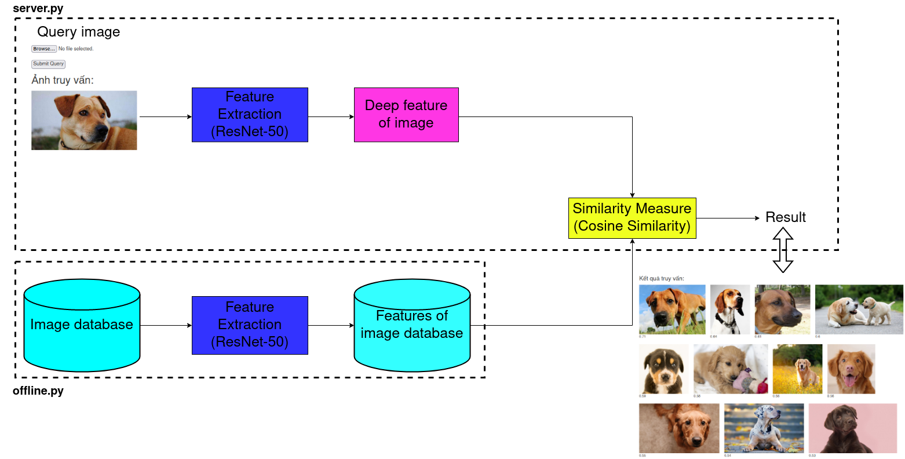
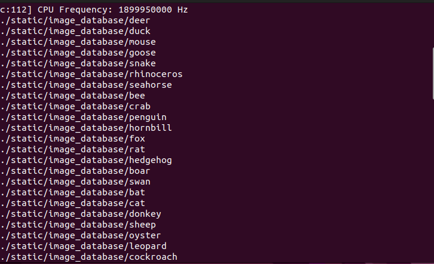
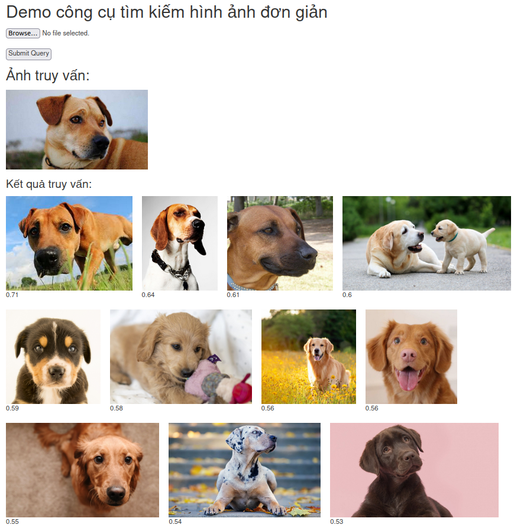

# Simple Image Retrieval System


## Overview
This project builds a simple Image Search Engine using the Keras framework with ResNet-50 as the backbone network (pre-train model). This system is a computer system used for browsing, searching and retrieving images from a large database of digital images.


## Method practice

Convolutional Neural Network (ResNet50 backbone) + Cosine Similarity.

## System flowcharts



## Structure of directory

```bash
├── feature_extractor.py
├── offline.py
├── __pycache__
│   └── feature_extractor.cpython-37.pyc
├── README.md
├── server.py
├── static
│   ├── feature_database
│   │   ├── concat_all_feature.npz
│   │   ├── lion.npz
│   │   ├── pig.npz
│   │   ├── ...
│   ├── image_database
│   │   ├── lion
│   │   │   ├── 0209bbf635.jpg
│   │   │   ├── 05d42c9bd8.jpg
│   │   │   ├── ...
│   │   ├── pig
│   │   │   ├── 00ddea87ad.jpg
│   │   │   ├── 02b26f142c.jpg
│   │   │   ├── ...
│   │   ├── ...
│   └── image_uploaded
└── templates
    └── index.html
```


## Hardware configuration

```
- Memory: 8,0 GiB
- Processor: Intel® Core™ i5-8365U CPU @ 1.60GHz × 8
- OS: Ubuntu 22.04.1 LTS (64-bit)
```


## Dataset

[Animal Image Dataset (90 different categories, 60 images per categories): 5400 Animal Images](https://www.kaggle.com/datasets/iamsouravbanerjee/animal-image-dataset-90-different-animals)


## Setup
- Python 3.7 is used in this repository.
- Clone the repository:
```
$ git clone https://github.com/danghieuan/image-retrieval-system.git
```


## Feature Extractor (Employing ResNet-50 as the backbone network)

```
$ cd image-retrieval-system
$ python offline.py
```



## Demo on Flask API

```
$ python server.py
```




## Todo
- Research Product Quantization algorithm for larger-scale indexing.


## Reference
- CVPR 2020 Tutorial on [Image Retrieval in the Wild](https://matsui528.github.io/cvpr2020_tutorial_retrieval/), author: Yusuke Matsui and Takuma Yamaguchi and Zheng Wang.
- He, Kaiming, et al. ["Deep residual learning for image recognition."](https://arxiv.org/abs/1512.03385) Proceedings of the IEEE conference on computer vision and pattern recognition. 2016.
- [Deep Learning with Python](https://www.manning.com/books/deep-learning-with-python) - François Chollet.
- [Changing the contrast and brightness of an image!](https://docs.opencv.org/3.4/d3/dc1/tutorial_basic_linear_transform.html) - OpenCV.
